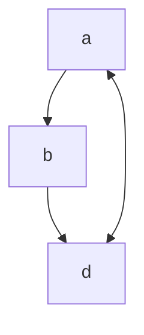

# fmt-iatemplate

[iA Writer](https://ia.net/writer) is a cross-platform app for focused writing, removing distractions and keeping the writing flow.

The app is Markdown-based, lacks any plugins but [supports templating](https://ia.net/writer/support/preview/templates), allowing for adding plugins.

Searching for a template that has (at least) MermaidJS support, I found [fiser_iatemplate](https://github.com/f1se4/fiser_iatemplate). The repo seems abandoned and it has a bug that prevents MermaidJS from rendering.

Although [I proposed a fix](https://github.com/f1se4/fiser_iatemplate/pull/3), I still prefer the iA Writer Github built-in template design, and as such, taking inspiration in the previous work, I built this fmt-iatemplate that adds MermaidJS, ChartJS, Plotly and Prism highlighting (with fixes for some collisons on the dark theme) to the GitHub base template.

So please enjoy and feel free to propose any changes or enhancements.

# Example document

{{TOC}}

## Usual markdown objects
### Text in paragraph

Here there is some text in *italic* and some in **bold** and link to my [Github](https://github.com/fmt) page.
We can also add some image [](https://avatars.githubusercontent.com/u/140614).

And continue with some different ==highlights== in the text, or if you want to correct a partner, you can ~~strikethrough~~ some text.

### Horizontal Rule

---

### Lists
#### Bullet list (*)
* List
* List
* List

#### Bullet list (-)
- List
- List
- List

#### Numerical list (n.)
1. One
2. Two
3. Three

#### Tasks Lists

- [ ] Unfinished task list item
- [ ] Another unfinished task
- [x] Finished task list item

### BlockQuote
> Normal BlockQuote

and big one

> BlockQuote with some several text that could be written in this textbox and with some different lines.
> And you can continue in a new line and add also some format like **a bold text** and *italics*.

and quote to quote to quote....
> This is the big quote
>> And quote inside a quote

### Code Blocks
#### Without code specification
```
This is code block normal with standard format
and it could be used, for example to represent an output from an execution in a command shell
```

#### With code highlighting
##### Python
```language-python
#This one has "language-python" as mark up in the code block
# and let's format it. (be aware of wrap lines!)

import numpy as np
import pandas as pd
import matlplotlib.pyplot as plt

df = pd.read("hola.csv",sep=";")
root = np.sqrt(25)

class sergiiatemplate:
    super():
        print("I'm python code")
```

##### SQL
```language-sql
SELECT
	*
FROM
	test
;
```

### Table
#### Normal Table
|Header |Column 1 | Column 2 | Column 3  | 
|:--- |:---- |:----:| ----:|
|1. Row| is | is | is  |
|2. Row| left | nicely | right  |
|3. Row| aligned | centered | aligned  | 

#### CSV Table, Transclusion

/GitHub-Mermaid-ChartJS-Plotly-Prism-CSV.csv

### Mathematical
An example of math inline ${e}^{i\pi }+1=0$

To show an expression by itself with double dollar:

$${x}_{1,2}=\frac{-b\pm \sqrt{{b}^{2}-4ac}}{2a}$$

## Plugins Add-ons

This plugins are managed through code block mark-up.

### Mermaid Plugin
[MermaidJS](https://mermaid.js.org/)



### Chart.js graph
[Chart.js](https://www.chartjs.org/)

```chart-chartjs
    {
      "type": "pie",
      "data": {
        "labels": [
          "Red",
          "Blue",
          "Yellow"
        ],
        "datasets": [
          {
            "data": [
              300,
              50,
              100
            ],
            "backgroundColor": [
              "#FF6384",
              "#36A2EB",
              "#FFCE56"
            ],
            "hoverBackgroundColor": [
              "#FF6384",
              "#36A2EB",
              "#FFCE56"
            ]
          }
        ]
      },
      "options": {
        "responsive": "false",
        "animation": "false"
        }
    }
```

### Plotly.js
[Plotly.js](https://plotly.com/javascript/)

```chart-plotly
[
{
x: [1, 2, 3, 4],
y: [10, 11, 12, 13],
mode: "markers",
marker: {
size: [40, 60, 80, 100]
}
}
]
```

```chart-plotly
[
{
x: [1,2,3,4,5],
y: [2,4,6,8,10]
}
]
```
